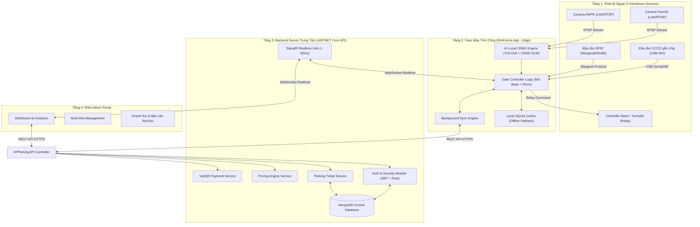
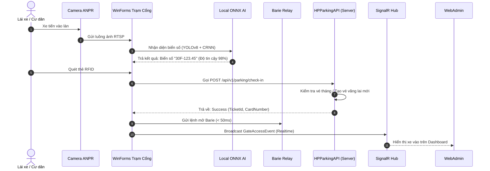
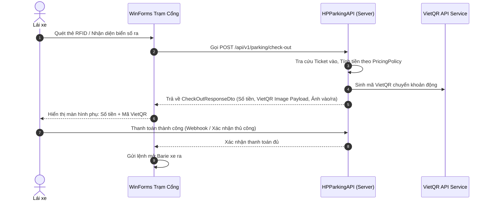
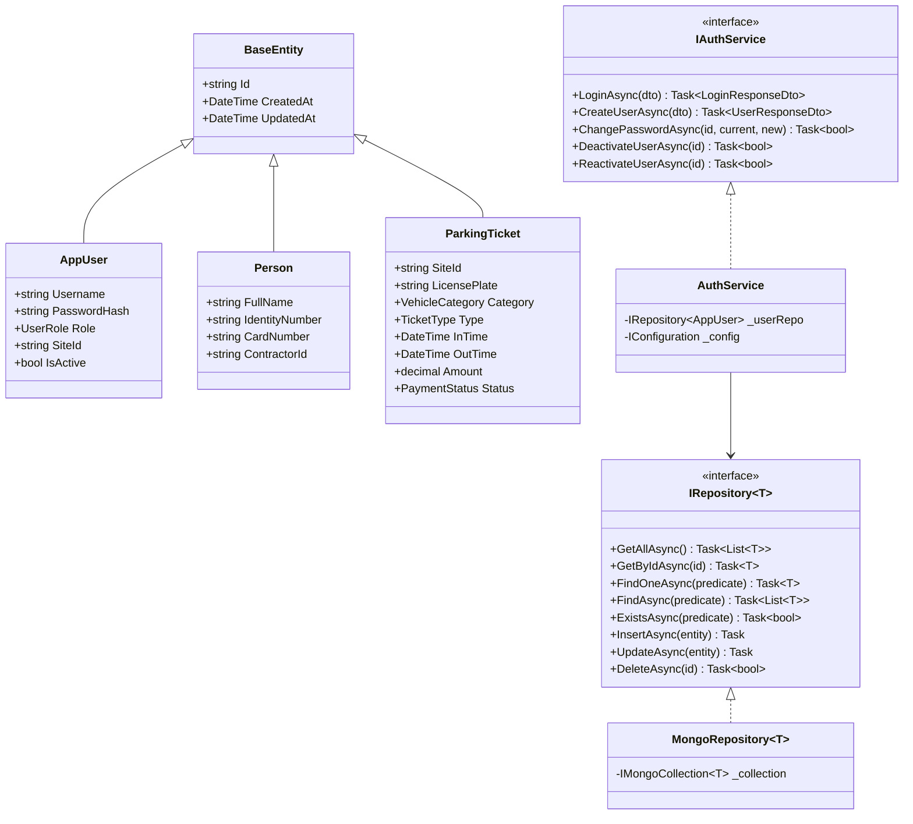

# HPParkingAPI — Solution Architecture Document

## 1. Physical Architecture Topology (Mô hình Kiến trúc Vật lý 4 Tầng)

---

## 2. Dynamic Sequence Flows (Sơ đồ Tiến trình Ra / Vào)

### 2.1. Luồng Xe Vào (Check-In Sequence)

### 2.2. Luồng Xe Ra & Tính Phí (Check-Out Sequence)

---

## 3. Project Class Architecture & Seam Placement

